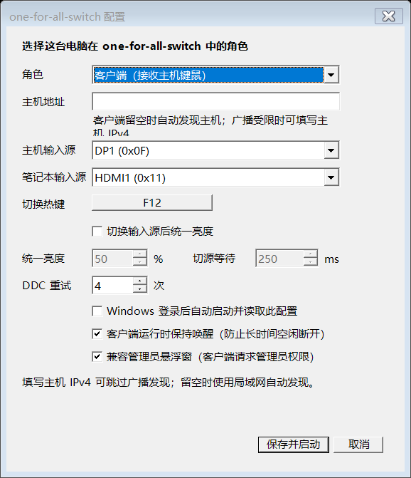

# one-for-all-switch

一套键鼠、两台 Windows 电脑、一个显示器，用一个快捷键同时切换键鼠控制和显示器输入源。

Keyboard and mouse sharing powered by [Deskflow](https://github.com/deskflow/deskflow), combined with DDC/CI monitor input switching. Windows x64 only.



## 功能

- 在配置界面选择主机或客户端，自定义切换快捷键，默认 `F12`。
- 通过 Deskflow 传输键盘和鼠标输入；通过 DDC/CI 切换显示器输入源。
- 鼠标到达屏幕边缘不会切换电脑，仅快捷键或托盘菜单触发切换。
- 支持局域网自动发现、配对、断线重连和 Windows 登录后自动启动。
- 客户端可保持唤醒，并可请求管理员权限以兼容以管理员身份运行的窗口。
- 可选切源后统一亮度。默认关闭，程序启动和退出时不主动设置亮度。

## 下载与使用

从 [Releases](https://github.com/N1ckyChan/one-for-all-switch/releases) 下载 Windows x64 ZIP 并完整解压。

首次使用时，在解压目录运行以下命令，下载并解压官方 Deskflow **1.26.0**。此步骤不安装 Deskflow 服务，完成后无需为每次启动重新下载。

```powershell
powershell -ExecutionPolicy Bypass -File .\setup-deskflow.ps1
```

如果已经有完整的 Deskflow 1.26.0 文件夹，直接放在 EXE 旁边即可。目录结构应为：

```text
one-for-all-switch.exe
Deskflow/
  deskflow-core.exe
  ...DLL、插件和许可证文件
```

1. 把准备好的整个目录复制到两台电脑；两台电脑应位于同一个可信局域网。
2. 键盘、鼠标接在主机上；两台电脑的视频输出分别接到同一个显示器。
3. 在显示器菜单中启用 **DDC/CI**。
4. 启动 `one-for-all-switch.exe`，在接键鼠的电脑上选择“主机”，另一台选择“客户端”。客户端地址可留空自动发现，也可填写主机 IPv4。
5. 选择主机和笔记本对应的显示器输入源，设置快捷键，点击“保存并启动”。随后从托盘或快捷键切换。

两端应使用同一版本。配置保存在 `%LOCALAPPDATA%\KvmSwitch\config.json`，保留该旧目录名是为了兼容原有用户的配置。不要分享其中的配对令牌。

旧版用户先退出旧程序，再使用新版；若移动了程序位置，重新保存一次“登录后自动启动”设置，以更新启动路径。

## 已验证的使用环境

Windows 11 主机与 Windows 11 笔记本，共用 KTC H27T22X：主机 DP1 为 `0x0F`，笔记本 HDMI1 为 `0x11`。其他显示器需要支持 DDC/CI VCP `0x60`，输入源编号与非活动输入下的 DDC 支持取决于显示器和显卡，尚未广泛验证。

## 常用配置

| 配置 | 说明 |
| --- | --- |
| 切换热键 | 默认 F12；由主机 Deskflow 处理。F23/F24 保留给内部切换命令。 |
| 登录后自动启动 | 读取已保存配置并进入托盘；管理员客户端使用当前用户的登录计划任务。 |
| 客户端保持唤醒 | 避免长时间空闲睡眠影响键鼠连接。 |
| 兼容管理员悬浮窗 | 客户端请求管理员权限；不保证可操作所有拒绝模拟输入的程序。 |
| 统一亮度 | 默认关闭；仅在明确启用后，于输入源切换时设置目标亮度。 |
| DDC 重试和等待 | 用于适配切换输入源较慢的显示器。 |

仅主机写入显示器 DDC/CI。客户端托盘通过单独控制连接请求主机切源，所以无需依赖笔记本在非活动输入下写入 DDC。

## 网络与使用边界

使用 Deskflow TCP `24800`、控制 TCP `24801`、自动发现 UDP `37998` 和本机回调 UDP `37997`。主机配置会请求权限添加防火墙规则。当前生成的 Deskflow 配置关闭 TLS，自动发现也会在局域网内传递配对令牌，因此仅适用于你信任的局域网；不要向公网开放这些端口。配对令牌用于控制指令校验，不提供网络加密。

客户端必须处于已登录的桌面会话。Windows 登录界面、UAC 安全桌面及部分特殊窗口不在当前支持范围内。

## 从源码构建

安装 Windows x64 的 [.NET 8 SDK](https://dotnet.microsoft.com/download/dotnet/8.0)，然后在仓库根目录运行：

```powershell
.\build.ps1 -Publish
```

输出在 `dist/`，无需目标电脑预装 .NET。准备运行所需的官方 Deskflow 依赖：

```powershell
.\setup-deskflow.ps1 -Destination .\dist\Deskflow
```

也可以用 `./build.ps1 -Publish -WithDeskflow` 合并这两个步骤。只构建代码用 `./build.ps1`。源码运行脚本 `run.ps1` 需要 PowerShell 7；正式发布推荐使用构建后的 EXE。

```powershell
dotnet run --project tests\KvmSwitch.Regression.csproj -c Release
```

回归测试覆盖配置保存、重连、控制帧、输入进程恢复、修饰键标志和计划任务不存在的处理。测试使用临时配置、回环连接和模拟子进程，不向真实键鼠注入输入，也不写入显示器 DDC。

## 鸣谢 Deskflow

特别感谢 **[Deskflow](https://github.com/deskflow/deskflow)** 项目及其所有贡献者。本项目的键盘鼠标共享能力由 Deskflow 提供；one-for-all-switch 负责配置界面、显示器输入源切换和连接协调，是独立项目，并非 Deskflow 官方产品。

- 使用版本：[Deskflow v1.26.0](https://github.com/deskflow/deskflow/releases/tag/v1.26.0)
- 对应源码：[v1.26.0 源码树](https://github.com/deskflow/deskflow/tree/v1.26.0)
- Deskflow 许可证：GPL-2.0-only，相关文件带 OpenSSL 链接例外；其他组件遵循各自许可证。

本项目源码采用 **GPL-2.0-only**，见 [LICENSE](LICENSE)。第三方归属和分发说明见 [THIRD_PARTY_NOTICES.md](THIRD_PARTY_NOTICES.md)。
